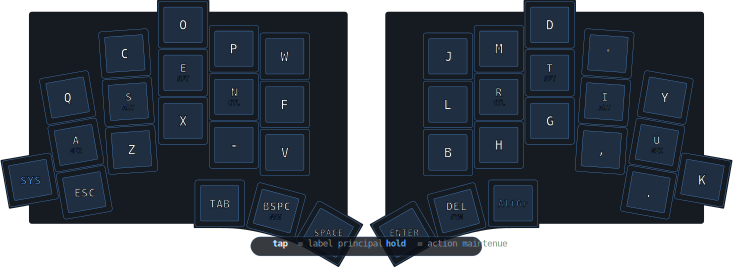
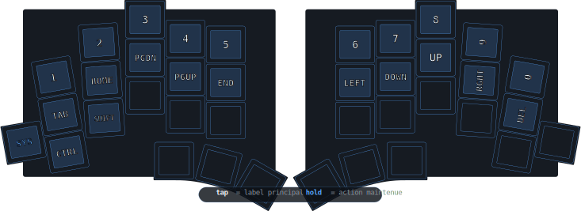
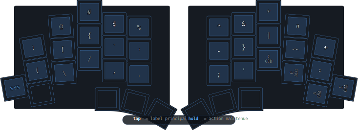
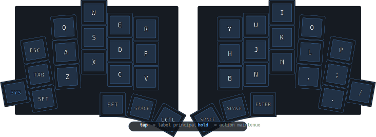
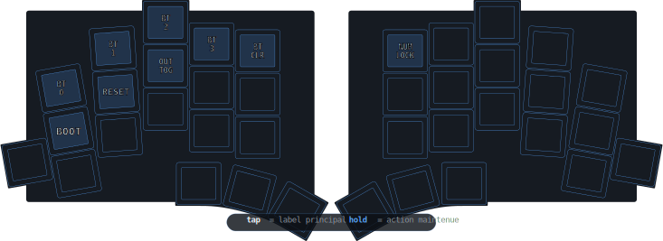

<picture>
  <source media="(prefers-color-scheme: dark)" srcset="./docs/images/TOTEM_logo_dark.svg">
  <source media="(prefers-color-scheme: light)" srcset="./docs/images/TOTEM_logo_bright.svg">
  
</picture>

# ZMK Config for the TOTEM Split Keyboard

Configuration ZMK pour un TOTEM 38 touches avec une disposition principale en Ergo-L, des home row mods, une couche navigation, une couche symboles, une couche systeme pour le Bluetooth et une couche jeu.

Ressources utiles :

- guide hardware TOTEM : <https://github.com/GEIGEIGEIST/totem>
- config QMK TOTEM : <https://github.com/GEIGEIGEIST/qmk-config-totem>
- documentation ZMK : <https://zmk.dev/>

## Vue d'ensemble

- clavier : TOTEM split 38 touches
- firmware : ZMK
- microcontroleur cible : SEEED XIAO BLE
- moitie centrale : gauche
- disposition principale : Ergo-L
- langue cible : `US-International`

## Demarrage Rapide

1. fork ce repo
2. modifie [`config/totem.keymap`](./config/totem.keymap)
3. pousse sur ton fork
4. ouvre l'onglet `Actions` sur GitHub
5. telecharge puis dezippe `firmware.zip`
6. flashe `totem_left-seeeduino_xiao_ble-zmk.uf2` sur la moitie gauche
7. flashe `totem_right-seeeduino_xiao_ble-zmk.uf2` sur la moitie droite

Important :

- ne melange pas `left` et `right` au flash
- un firmware gauche charge sur la droite, ou l'inverse, donne un clavier incoherent

Fichiers generes par le build :

| Fichier | Usage |
| --- | --- |
| `totem_left-seeeduino_xiao_ble-zmk.uf2` | firmware normal pour la moitie gauche |
| `totem_right-seeeduino_xiao_ble-zmk.uf2` | firmware normal pour la moitie droite |
| `settings_reset-seeeduino_xiao_ble-zmk.uf2` | firmware temporaire pour vider les settings Bluetooth |

## Philosophie du Keymap

| Couche | Acces | Role |
| --- | --- | --- |
| `BASE` | par defaut | frappe principale en Ergo-L |
| `NAV` | maintenir `NAV/BSPC` | chiffres, fleches, navigation |
| `SYM` | maintenir `SYM/DEL` | symboles et accents |
| `SYS` | maintenir `SYS` | Bluetooth, bootloader, reset, sortie USB/BLE |
| `GAME` | combo des 2 touches externes du bas | disposition jeu |

## Reglage Systeme

Pour que les accents fonctionnent comme prevu, configure le systeme en `US-International`.

### Windows

- `Parametres > Heure et langue > Langue et region`
- ouvre la langue active
- `Ajouter un clavier`
- choisis `United States-International`
- bascule de disposition avec `Win + Espace`

### macOS

- ajoute `U.S. International - PC`

### Linux

- choisis `English (US, intl., with dead keys)` ou l'equivalent

## Legende

- `A/GUI` : tape `A`, maintiens `GUI`
- `S/ALT` : tape `S`, maintiens `Alt`
- `E/SFT` : tape `E`, maintiens `Shift`
- `N/CTL` : tape `N`, maintiens `Control`
- `NAV/BSPC` : tape `Backspace`, maintiens `NAV`
- `SYM/DEL` : tape `Delete`, maintiens `SYM`
- `AltGr` : `Right Alt` sticky
- `SYS` : acces momentane a la couche systeme
- dans les images, le texte blanc indique l'action en tap
- dans les images, le texte bleu indique l'action au maintien

## Couche BASE

Disposition principale en Ergo-L.

## Home Row Mods

Les touches de repos portent les modificateurs :

- main gauche : `A=GUI`, `S=Alt`, `E=Shift`, `N=Control`
- main droite : `R=Control`, `T=Shift`, `I=Alt`, `U=GUI`

Reglage actuel :

- `tapping-term-ms = 200`
- `flavor = "tap-preferred"`

Conseils :

- tape rapidement pour obtenir la lettre
- maintiens legerement plus longtemps pour obtenir le modificateur
- si tu as trop d'activations accidentelles, essaie `220` ou `230`

## Couche NAV

Acces : maintenir `NAV/BSPC`.

Sur cette image, les touches sans label sont transparentes : elles laissent passer le comportement d'une autre couche si besoin.

Raccourcis utiles sur `NAV` :

- `Ctrl + Left/Right` : deplacement mot par mot
- `Shift + fleches` : selection de texte
- `Ctrl + Shift + Left/Right` : selection mot par mot

## Couche SYM

Acces : maintenir `SYM/DEL`.

Raccourcis utiles sur cette couche :

- `C ced` : `c cedilla`
- `E acu` : `e acute`
- `A gra` : `a grave`
- `E gra` : `e grave`

## Accents Francais

Deux methodes sont prevues.

### Combos rapides

- `A + S -> a grave`
- `E + R -> e acute`
- `I + O -> e grave`

Ces combos sont actifs sur `BASE`.

### AltGr et couche SYM

Le thumb droit externe agit comme un `AltGr` sticky :

1. touche `AltGr`
2. tape la touche cible

Exemples utiles avec `US-International` :

- `AltGr + E -> e acute`
- `AltGr + C -> c cedilla`

Pour `a grave` et `e grave`, le keymap envoie la sequence de touche morte grave du layout `US-International`.

## Couche GAME

Disposition jeu recentree pour mieux tomber sous la main gauche.

Activation :

- appuie simultanement sur les 2 touches externes de la rangee du bas
- le meme combo desactive aussi `GAME`

Pourquoi ce choix :

- `WASD` est plus recentre
- `A`, `S`, `D` tombent mieux sous les doigts de repos
- `Shift`, `Ctrl` et `Space` sont plus accessibles sur les pouces

## Couche SYS

Acces : maintenir `SYS`.

Rappel :

- `BT 0` a `BT 3` selectionnent le profil Bluetooth
- `BT CLR` efface le profil Bluetooth courant
- `BOOT` entre dans le bootloader
- `RESET` redemarre le clavier
- `OUT TOG` bascule la sortie preferee entre `USB` et `BLE`

## Depannage Bluetooth

Si le clavier apparait mais refuse de se connecter, ou si le systeme affiche une erreur vague :

1. supprime le clavier cote systeme avec `Oublier cet appareil`
2. flashe `settings_reset-seeeduino_xiao_ble-zmk.uf2` sur la moitie gauche
3. flashe `settings_reset-seeeduino_xiao_ble-zmk.uf2` sur la moitie droite
4. reflashe `totem_left-seeeduino_xiao_ble-zmk.uf2` sur la gauche
5. reflashe `totem_right-seeeduino_xiao_ble-zmk.uf2` sur la droite
6. redemarre les 2 moities a peu pres en meme temps
7. repars sur `BT 0` pour un nouveau pairing

Points utiles :

- le firmware `settings_reset` desactive temporairement le Bluetooth, c'est normal
- si le clavier est branche en USB pendant les tests, pense a faire `OUT TOG` pour retester en BLE
- en split ZMK, les problemes de connexion viennent souvent d'anciens pairages restes en memoire

## Fichiers Utiles

- keymap principal : [`config/totem.keymap`](./config/totem.keymap)
- configuration clavier : [`config/totem.conf`](./config/totem.conf)
- matrix de build GitHub : [`build.yaml`](./build.yaml)
- shield TOTEM : [`config/boards/shields/totem`](./config/boards/shields/totem)
- schema materiel : [`docs/images/TOTEM_layout.svg`](./docs/images/TOTEM_layout.svg)
- generateur des schemas README : [`scripts/generate-readme-svgs.ps1`](./scripts/generate-readme-svgs.ps1)
