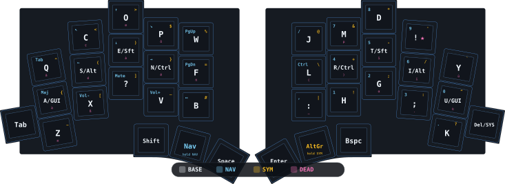

<picture>
  <source media="(prefers-color-scheme: dark)" srcset="./docs/images/TOTEM_logo_dark.svg">
  <source media="(prefers-color-scheme: light)" srcset="./docs/images/TOTEM_logo_bright.svg">
  
</picture>

# ZMK Config for the TOTEM Split Keyboard

Configuration ZMK pour un TOTEM 38 touches, inspiree d'Ergo-L et adaptee au format split. Le clavier est prevu pour un systeme configure en `English (United States)` : les couches, AltGr, accents et caracteres speciaux sont geres par le firmware.

## Demarrage

1. Modifie [`config/totem.keymap`](./config/totem.keymap).
2. Pousse les changements sur GitHub.
3. Recupere `firmware.zip` dans l'onglet `Actions`.
4. Flashe `totem_left-seeeduino_xiao_ble-zmk.uf2` sur la moitie gauche.
5. Flashe `totem_right-seeeduino_xiao_ble-zmk.uf2` sur la moitie droite.

Ne melange pas les firmwares `left` et `right`.

## Couches

| Couche | Acces | Role |
| --- | --- | --- |
| `BASE` | par defaut | frappe principale |
| `NAV` | maintenir `Nav` au pouce gauche | navigation, selection, chiffres, medias |
| `SYM` | maintenir `AltGr` au pouce droit | symboles |
| `DEAD` | maintenir `! / ★` | accents et caracteres speciaux |
| `SYS` | maintenir `Del/SYS` | Bluetooth, bootloader, reset, sortie USB/BLE |
| `GAME` | combo des 2 touches externes du bas | couche jeu recentree |

## Vue Cumulee

Cette image regroupe `BASE`, `NAV`, `SYM` et `DEAD`.

Code couleur :

- `BASE` : blanc, principal
- `NAV` : bleu, secondaire
- `SYM` : jaune, secondaire
- `DEAD` : rose, discret

## BASE

Home row mods :

- main gauche : `A=GUI`, `S=Alt`, `E=Shift`, `N=Control`
- main droite : `R=Control`, `T=Shift`, `I=Alt`, `U=GUI`
- `tapping-term-ms = 200`
- `flavor = tap-preferred`

Pouces :

- gauche : `Shift`, `Nav`, `Space`
- droite : `Enter`, `AltGr`, `Backspace`

## NAV

La couche `NAV` permet la navigation sans quitter le clavier :

- `Shift + fleches` pour selectionner du texte
- `Ctrl + fleches` pour se deplacer par mots/blocs
- `Ctrl + Shift + fleches` pour selectionner par mots/blocs

Disposition importante :

| Zone | Sorties |
| --- | --- |
| haut gauche | `Tab Home Up End PgUp` |
| home gauche | `Shift Left Down Right PgDn` |
| haut droite | `/ 7 8 9` |
| home droite | `Ctrl 4 5 6 0` |
| bas droite | `, 1 2 3 .` |

`Ctrl` remplace volontairement `-` sur `NAV`, car `-` reste disponible sur `SYM`.

## SYM

Acces : maintenir `AltGr`.

Symboles principaux :

- gauche : `^ < > $ %`, `{ ( ) } =`, `~ [ ] _ #`
- droite : `@ & * ' \``, `\ + - / "`, `| ! ; : ?`

## DEAD

Acces : maintenir `! / ★`.

Cette couche emule une touche morte firmware pour les accents et caracteres speciaux, via des macros Alt-code Windows.

Exemples :

- `★ + S = é`
- `★ + E = è`
- `★ + A = à`
- `★ + C = ç`
- `★ + O = œ`
- `★ + G = α`

Limite : ces macros sont surtout prevues pour Windows en `English (United States)`. macOS et Linux peuvent interpreter les Alt-codes differemment.

## SYS

Fonctions disponibles :

- `BT 0` a `BT 3` : selection du profil Bluetooth
- `BT CLR` : efface le profil courant
- `OUT TOG` : bascule USB/BLE
- `BOOT` : bootloader
- `RESET` : redemarrage clavier
- `NUM LOCK` : secours pour les macros Alt-code

## GAME

Activation :

- appuie simultanement sur les 2 touches externes de la rangee du bas
- le meme combo desactive `GAME`

La couche jeu garde `WASD` recentre, avec `Shift`, `Ctrl`, `Space` et `Enter` proches des pouces.

## Bluetooth

Si le clavier refuse de se connecter :

1. Supprime `TOTEM` cote systeme.
2. Flashe `settings_reset-seeeduino_xiao_ble-zmk.uf2` sur les deux moities.
3. Reflashe les firmwares normaux gauche/droite.
4. Redemarre les deux moities presque en meme temps.
5. Selectionne `BT 0`, puis refais le pairing.

Options utiles deja activees :

- `CONFIG_ZMK_SLEEP=n`
- `CONFIG_ZMK_IDLE_TIMEOUT=300000`
- `CONFIG_ZMK_BLE_EXPERIMENTAL_CONN=y`
- `CONFIG_BT_GATT_ENFORCE_SUBSCRIPTION=n`
- `CONFIG_BT_CTLR_TX_PWR_PLUS_8=y`

## Fichiers

- keymap : [`config/totem.keymap`](./config/totem.keymap)
- configuration : [`config/totem.conf`](./config/totem.conf)
- build matrix : [`build.yaml`](./build.yaml)
- shield TOTEM : [`config/boards/shields/totem`](./config/boards/shields/totem)
- generateur SVG : [`scripts/generate-readme-svgs.ps1`](./scripts/generate-readme-svgs.ps1)
