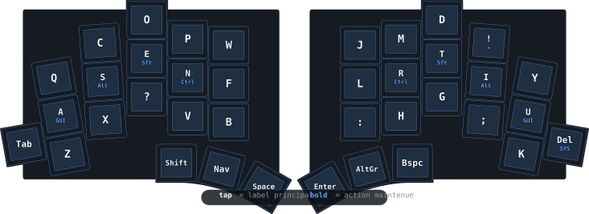
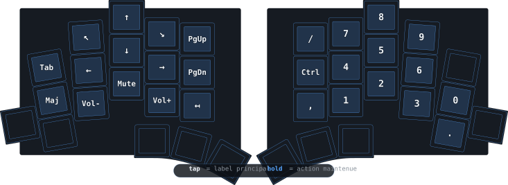
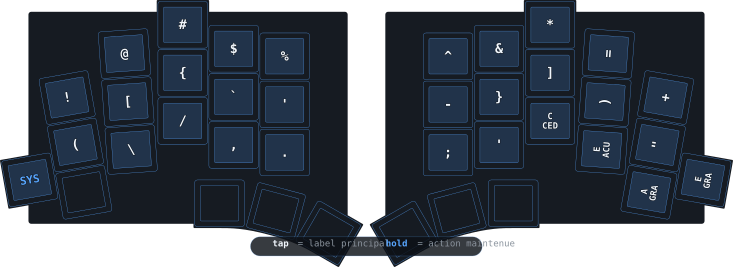
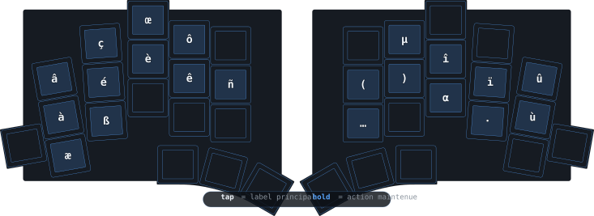
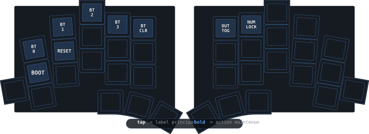
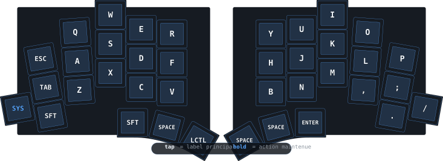

<picture>
  <source media="(prefers-color-scheme: dark)" srcset="./docs/images/TOTEM_logo_dark.svg">
  <source media="(prefers-color-scheme: light)" srcset="./docs/images/TOTEM_logo_bright.svg">
  
</picture>

# ZMK Config for the TOTEM Split Keyboard

Configuration ZMK pour un TOTEM 38 touches avec une disposition principale inspiree d'Ergo-L, adaptee au format TOTEM et utilisable sans driver de layout cote systeme.

Le clavier est prevu pour etre branche en plug-and-play sur un hote configure en `English (United States)`. Toute la logique de couches, d'AltGr et de touche morte ★ vit dans le firmware ZMK.

Ressources utiles :

- guide hardware TOTEM : <https://github.com/GEIGEIGEIST/totem>
- config QMK TOTEM : <https://github.com/GEIGEIGEIST/qmk-config-totem>
- documentation ZMK : <https://zmk.dev/>

## Vue d'ensemble

- clavier : TOTEM split 38 touches
- firmware : ZMK
- microcontroleur cible : SEEED XIAO BLE
- moitie centrale : gauche
- disposition principale : noyau Ergo-L adapte au TOTEM
- disposition systeme attendue : `English (United States)`
- aucune installation de driver Ergo-L ou `US-International` cote OS

## Demarrage Rapide

1. fork ce repo
2. modifie [`config/totem.keymap`](./config/totem.keymap)
3. pousse sur ton fork
4. ouvre l'onglet `Actions` sur GitHub
5. telecharge puis dezippe `firmware.zip`
6. flashe `totem_left-seeeduino_xiao_ble-zmk.uf2` sur la moitie gauche
7. flashe `totem_right-seeeduino_xiao_ble-zmk.uf2` sur la moitie droite

Important :

- ne melange pas `left` et `right` au flash
- un firmware gauche charge sur la droite, ou l'inverse, donne un clavier incoherent

Fichiers generes par le build :

| Fichier | Usage |
| --- | --- |
| `totem_left-seeeduino_xiao_ble-zmk.uf2` | firmware normal pour la moitie gauche |
| `totem_right-seeeduino_xiao_ble-zmk.uf2` | firmware normal pour la moitie droite |
| `settings_reset-seeeduino_xiao_ble-zmk.uf2` | firmware temporaire pour vider les settings Bluetooth |

## Philosophie du Keymap

Le keymap reprend la logique observee sur le Ferris valide, mais exploite les touches supplementaires du TOTEM :

- les lettres et la ponctuation courante sont sur `BASE`
- `Nav` donne une couche navigation + chiffres
- `AltGr` donne une couche symboles, sans changer le layout OS
- la touche `! / ★` donne acces aux accents et alterations via une couche dediee `DEAD`
- `SYS` reste reserve au Bluetooth, au bootloader, au reset et a la sortie USB/BLE
- `GAME` conserve la couche jeu existante

| Couche | Acces | Role |
| --- | --- | --- |
| `BASE` | par defaut | frappe principale Ergo-L adaptee au TOTEM |
| `NAV` | maintenir `Nav` au pouce gauche | navigation, medias, chiffres |
| `SYM` | maintenir `AltGr` au pouce droit | symboles type AltGr |
| `DEAD` | maintenir `! / ★` | accents, ligatures et caracteres speciaux |
| `SYS` | maintenir `Del/SYS` | Bluetooth, bootloader, reset, sortie USB/BLE |
| `GAME` | combo des 2 touches externes du bas | disposition jeu |

## Reglage Systeme

Garde la disposition systeme en `English (United States)`.

Ce keymap ne demande pas :

- de driver Ergo-L cote OS
- de layout `US-International`
- de remapping logiciel sur l'ordinateur

Les lettres, les chiffres et les symboles ASCII sont envoyes comme des keycodes HID US standards. Les caracteres de la couche `DEAD` qui n'existent pas directement sur un clavier US, comme `é`, `è`, `à`, `ç`, `œ` ou `α`, sont emis par des macros ZMK de type Alt-code Windows.

Limite honnete :

- cette implementation est firmware-side, mais ce n'est pas une vraie touche morte Unicode universelle
- les sorties `DEAD` speciales sont surtout prevues pour Windows en `English (United States)`
- macOS et Linux peuvent ne pas interpreter ces macros Alt-code de la meme maniere
- la touche `NUM LOCK` est gardee sur `SYS` uniquement comme secours si un hote Windows refuse les Alt-codes au pave numerique

## Touche Morte ★

Sur `BASE`, la touche `!` porte aussi la logique de touche morte ★ :

- tap sur `! / ★` : envoie `!`
- hold sur `! / ★` : active la couche `DEAD`

Dans cette version ZMK-only, `★` est donc emulee par un maintien de la touche `!`. L'experience utilisateur voulue est : maintenir `! / ★`, appuyer sur la lettre ou le symbole affiche sur la couche `DEAD`, puis relacher.

Dans le firmware, cette touche utilise un hold-tap dedie en `hold-preferred` : elle reste un `!` quand elle est pressee seule, mais bascule rapidement sur `DEAD` quand une autre touche est pressee pendant son maintien.

Exemples :

- `★ + S` donne `é`
- `★ + E` donne `è`
- `★ + A` donne `à`
- `★ + C` donne `ç`
- `★ + O` donne `œ`
- `★ + G` donne `α`

`★ ★ = trema mort` n'est pas implemente pour le moment. Le firmware n'essaie pas de simuler un comportement faux : les caracteres disponibles sont ceux affiches sur la couche `DEAD`.

## Legende

- `A/GUI` : tape `A`, maintiens `GUI`
- `S/Alt` : tape `S`, maintiens `Alt`
- `E/Sft` : tape `E`, maintiens `Shift`
- `N/Ctrl` : tape `N`, maintiens `Control`
- `R/Ctrl`, `T/Sft`, `I/Alt`, `U/GUI` : home-row mods de la main droite
- `! / ★` : tape `!`, maintiens pour `DEAD`
- `Del/SYS` : tape `Delete`, maintiens pour `SYS`
- `Nav` : acces momentane a `NAV`
- `AltGr` : acces momentane a `SYM`, nomme comme la logique Ergo-L mais implemente comme une couche ZMK
- dans les images, le texte blanc indique l'action en tap
- dans les images, le texte bleu indique l'action au maintien

## Couche BASE

Noyau alpha :

| Main gauche | Main droite |
| --- | --- |
| `Q C O P W` | `J M D ! Y` |
| `A S E N F` | `L R T I U` |
| `Z X ? V B` | `: H G ; K` |

Touches supplementaires TOTEM :

- pinky externe gauche : `Tab`
- pinky externe droite : `Delete` en tap, `SYS` en hold
- pouces gauche : `Shift`, `Nav`, `Space`
- pouces droite : `Enter`, `AltGr`, `Backspace`

Home row mods :

- main gauche : `A=GUI`, `S=Alt`, `E=Shift`, `N=Control`
- main droite : `R=Control`, `T=Shift`, `I=Alt`, `U=GUI`

Reglage actuel :

- `tapping-term-ms = 200`
- `flavor = "tap-preferred"`

## Couche NAV

Acces : maintenir `Nav`.

La couche `NAV` combine navigation, medias et chiffres. Les chiffres sont envoyes comme touches de la rangee numerique US, pas comme keypad numerique, donc ils ne dependent pas de `NumLock`.

| Position BASE | Sortie NAV |
| --- | --- |
| `Q C O P W` | `Tab Home Up End PgUp` |
| `A S E N F` | `Shift Left Down Right PgDn` |
| `X ? V B` | `Vol- Mute Vol+ Backspace` |
| `J M D ! Y` | `/ 7 8 9` |
| `L R T I U` | `- 4 5 6 0` |
| `: H G ; K` | `, 1 2 3 .` |

## Couche SYM

Acces : maintenir `AltGr`.

Cette couche reprend la logique AltGr du Ferris valide, mais reste une couche ZMK pure.

| Position BASE | Sortie SYM |
| --- | --- |
| `Q C O P W` | `^ < > $ %` |
| `A S E N F` | `{ ( ) } =` |
| `Z X ? V B` | `~ [ ] _ #` |
| `J M D ! Y` | <code>@ &amp; * ' &#96;</code> |
| `L R T I U` | <code>\ + - / "</code> |
| `: H G ; K` | <code>&#124; ! ; : ?</code> |

## Couche DEAD

Acces : maintenir `! / ★`.

La couche `DEAD` emule la touche morte ★ d'Ergo-L avec des macros firmware. Elle donne acces aux accents et alterations principales sans changer la disposition systeme.

| Position BASE | Sortie DEAD |
| --- | --- |
| `Q C O P` | `â ç œ ô` |
| `A S E N F` | `à é è ê ñ` |
| `Z X` | `æ ß` |
| `M Y` | `µ û` |
| `L R T I U` | `( ) î ï ù` |
| `: G ;` | `… α ·` |

`★ + G` donne actuellement `α`, ce qui pose la premiere brique grecque. Les autres lettres grecques ne sont pas encore mappees.

## Couche SYS

Acces : maintenir `Del/SYS`.

Dans le keymap ZMK, `SYS` est placee au-dessus de `GAME` pour rester accessible meme quand la couche jeu est active.

Touches disponibles :

- `BT 0` a `BT 3` selectionnent un profil Bluetooth
- `BT CLR` efface le profil Bluetooth courant
- `OUT TOG` bascule la sortie preferee entre `USB` et `BLE`
- `BOOT` entre dans le bootloader
- `RESET` redemarre le clavier
- `NUM LOCK` est garde comme secours pour les macros Alt-code Windows de `DEAD`

## Couche GAME

La couche `GAME` est conservee pour ne pas casser le workflow existant.

Activation :

- appuie simultanement sur les 2 touches externes de la rangee du bas
- le meme combo desactive aussi `GAME`

Cette couche reste une disposition jeu recentree avec `WASD`, `Shift`, `Ctrl`, `Space` et `Enter` accessibles rapidement.

## Depannage Bluetooth

Si le clavier apparait mais refuse de se connecter, ou si le systeme affiche une erreur vague :

1. supprime le clavier cote systeme avec `Oublier cet appareil`
2. flashe `settings_reset-seeeduino_xiao_ble-zmk.uf2` sur la moitie gauche
3. flashe `settings_reset-seeeduino_xiao_ble-zmk.uf2` sur la moitie droite
4. reflashe `totem_left-seeeduino_xiao_ble-zmk.uf2` sur la gauche
5. reflashe `totem_right-seeeduino_xiao_ble-zmk.uf2` sur la droite
6. redemarre les 2 moities a peu pres en meme temps
7. repars sur `BT 0` pour un nouveau pairing

Points utiles :

- le firmware `settings_reset` desactive temporairement le Bluetooth, c'est normal
- si le clavier est branche en USB pendant les tests, pense a faire `OUT TOG` pour retester en BLE
- en split ZMK, les problemes de connexion viennent souvent d'anciens pairages restes en memoire

### Deconnexions rapides ou reveil lent

Le firmware garde volontairement le `deep sleep` desactive pendant le diagnostic Bluetooth. En etat `idle`, ZMK doit rester connecte au Bluetooth ; une deconnexion rapide n'est donc pas un comportement normal de veille.

Pour eviter une impression de reveil trop lent pendant les tests, le repo force aussi :

- `CONFIG_ZMK_SLEEP=n` pour empecher le sommeil profond qui coupe le Bluetooth
- `CONFIG_ZMK_IDLE_TIMEOUT=300000` pour attendre 5 minutes avant l'etat `idle` au lieu du defaut ZMK de 30 secondes

Ce repo active aussi trois options de stabilite Bluetooth :

- `CONFIG_ZMK_BLE_EXPERIMENTAL_CONN=y` pour eviter certains problemes de PHY 2 Mbps, surtout avec des chipsets Windows Realtek/Intel
- `CONFIG_BT_GATT_ENFORCE_SUBSCRIPTION=n` pour contourner un bug Windows lie aux notifications batterie
- `CONFIG_BT_CTLR_TX_PWR_PLUS_8=y` pour augmenter la puissance radio BLE du nRF52840

Procedure conseillee apres un changement Bluetooth :

1. supprime `TOTEM` dans les parametres Bluetooth Windows
2. flashe `settings_reset-seeeduino_xiao_ble-zmk.uf2` sur les deux moities
3. reflashe ensuite `totem_left...` sur la gauche et `totem_right...` sur la droite
4. redemarre les deux moities presque en meme temps
5. selectionne `BT 0`, puis refais un pairing propre depuis Windows
6. si Windows reconnecte puis deconnecte encore, redemarre le Bluetooth Windows ou supprime l'ancien peripherique cache depuis le Gestionnaire de peripheriques

Si le probleme continue apres ca, teste aussi avec la moitie gauche tres proche du PC, loin d'un hub USB 3 ou d'une coque metallique. Une batterie faible ou une alimentation instable peut aussi faire redemarrer la moitie centrale et ressembler a une deconnexion Bluetooth.

## Fichiers Utiles

- keymap principal : [`config/totem.keymap`](./config/totem.keymap)
- configuration clavier : [`config/totem.conf`](./config/totem.conf)
- matrix de build GitHub : [`build.yaml`](./build.yaml)
- shield TOTEM : [`config/boards/shields/totem`](./config/boards/shields/totem)
- schema materiel : [`docs/images/TOTEM_layout.svg`](./docs/images/TOTEM_layout.svg)
- generateur des schemas README : [`scripts/generate-readme-svgs.ps1`](./scripts/generate-readme-svgs.ps1)
